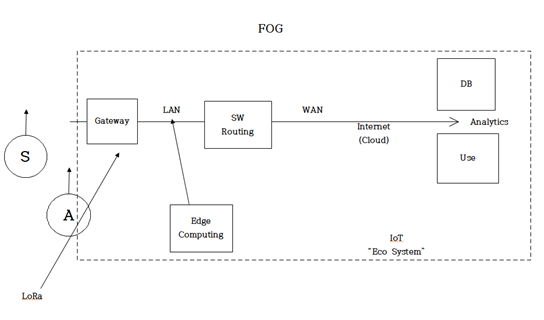

<h2>1주차 팀 회의</h2>
 

 
<h3>2018년 12월 31일 월요일 / 11시 30분 ~ 16시 00분 / K-SQUARE </h3>
 
<h4>참석자</h4>

유정연, 김현묵, 윤지애

 
<h4>하루 목표</h4>
<ol>
<li>gitHub 블로그 만들기</li>
<li>K-SQUARE 프로젝트 규칙 정하기</li>
<li>웹 app 템플릿 정하기</li>
</ol>
 
<h4>달성한 것</h4>
<ul>
<li><a href="https://yeon1123.github.io">블로그 주소</a></li>
<li>규칙 : 평일 내에 일정 시간 내에 만나서 공부하기, 월~금 9~5시에 팀 프로젝트 시간 확립 등(블로그에 업데이트 함)</li>
<li><a href="https://www.os-templates.com/free-website-templates/pobabini">웹 템플릿 홈페이지</a></li>
</ul>
 
<h4>해야 하는 것</h4>
<ol>
<li>Tony 교수님과 주제 회의(토양 재질에 따른 투수성을 측정 후 전달[Measuring and Transmissing permeability about kinds of soils for periodic]</li>
<li>응용법에 대한 질문(가져온 데이터를 어디에 쓸 것인가?[How do we use the data we get?])</li>
<li>LoRa 관련 공부 자료 받기/세미나에 대해 여쭤보기</li>
<li>논문 추천받기 or 찾은 논문을 읽고 정리(조원들 보기 편하게!)</li>
</ol>
 

 
<h3>2019년 01월 02일 수요일 / 8시 40분 ~ 17시 20분 / K-SQUARE </h3>
 
<h4>참석자</h4>

유정연, 김현묵, 윤지애

 
<h4>하루 목표</h4>
<ol>
<li>10시 반까지 IoT for agriculture 관련 선행 자료 찾아보기</li>
<li>10시 반 ~ 11시 반까지 회의 -> 대주제 잡기, 질문 정리</li>
<li>1시~ : tony와 회의</li>
<li>대주제 정리</li>
</ol>
 
<h4>달성한 것</h4>
<ul>
<li>1:00pm : Meeting with Anthony Smith
<ul>
<li></li>
<li>IoT의 전체적인 설명. 예시)토양의 수분 측정, 태양열 측정 등을 이용하여 습도를 측정하고 스프링쿨러 등을 작동시키는 smart farm이 있음.(기초적인 예시)</li>
<li>가져온 정보를 분석해서 필요한 곳에 응용하는 것이 핵심이다.</li>
<li>Edge computing, Fog computing 등 여러 가지 예시가 있음.</li>
<li>Draw diagram(Using Flow Chart)</li>
<li>No prototype, just proof of concept!</li>
<li>Sensing -> Making Decision(Analytics) -> Action</li>
<li>lecture : <a href="https://selfservice.mypurdue.purdue.edu/prod/bwckschd.p_disp_detail_sched?term_in=201920&crn_in=17034">wireless class</a></li>
<li>연락처 : 377B, KnoyHall of Technology / AHSmith@purdue.edu / purdueit114@hotmail.com / kakaotalk : dcurmudgeon </li>
</ul>
</li>
<li>각자 논문을 읽고 정리함</li>
<li>예비 소주제 결정 - Smart farm : After receiving data of temperature and humidity, and compare them with standard data. And control or recommend how to manage their data for corns. 
</li>
</ul>
 
<h4>달성하지 못한 것</h4>
<ol>
<li>질문을 다 못함</li>
<li>유정연 : 탐색한 논문 마저 탐색하기</li>
</ol>
 
<h4>해야 하는 것</h4>
<ol>
<li>교수님께 질문
<ol>
<li>I want to ask you some practical researches or book? (Lora)</li>
<li>In the paper, we read we will go field like the farm. Is Our project control farm size work?</li>
<li>When can we get some seminar?</li>
<li>Using the diagram, get some advice for professor about our subject.</li>
<li>We want to use a temperature sensor, but I wonder it works in the soil.</li>
</ol>
</li>
<li>재료 선정</li>
<li>아두이노 써서 센서 연결 + LED</li>
<li>presentation 준비</li>
</ol>
 

 

_ _ _

